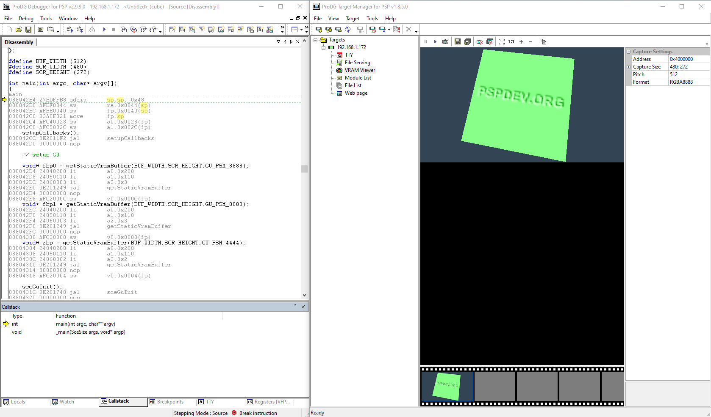
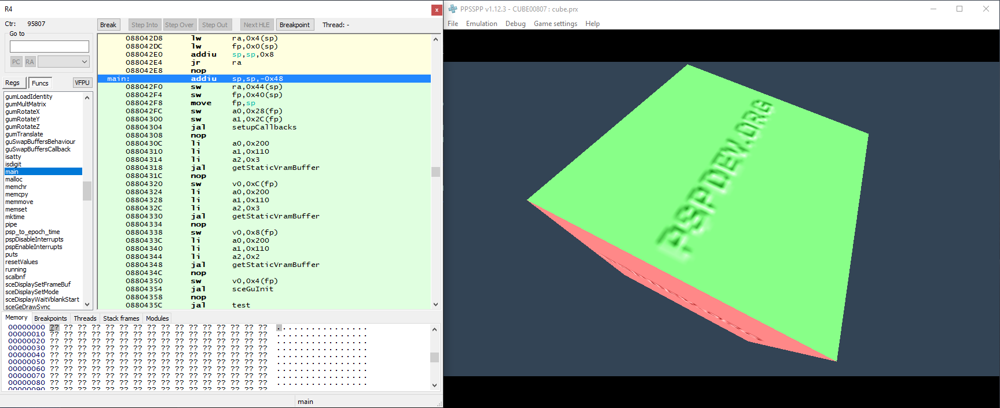

Modified prxgen to produce a prx which a psp devkit can debug and profile from.

Only tested on the open source pspsdk running on gcc 4.3.2, newer gcc will most likely not work since the dwarf layout has changed.

You can get a pspsdk running on gcc 4.3.2 from here https://github.com/PSP-Archive/ARK-4/tree/main/contrib/PC/PSPSDK

